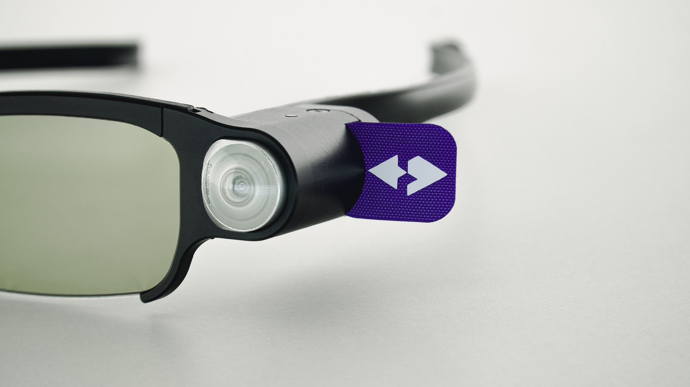
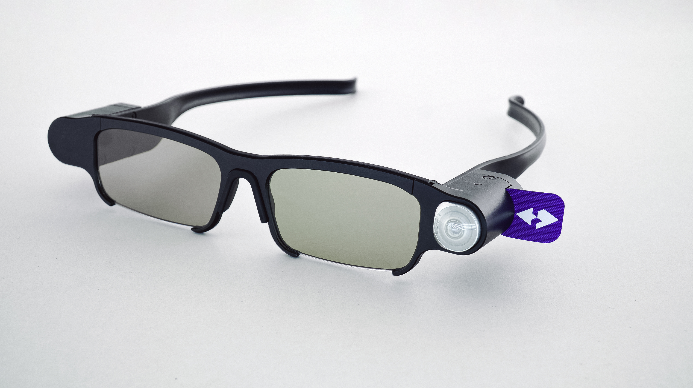

# IllumetryBrandAssets
# Images
## Glasses

jpg | image
--- | ---
[Glasses1.jpg](Glasses1.jpg) | 
[Glasses2.jpg](Glasses2.jpg) | 
[Glasses3.jpg](Glasses3.jpg) | 
[Glasses4.jpg](Glasses4.jpg) | 
[Glasses5.jpg](Glasses5.jpg) | 
[Glasses6.jpg](Glasses6.jpg) | 

## Users

jpg | image
--- | ---
[User1.jpg](User1.jpg) | 
[User2.jpg](User2.jpg) | 
[User3.jpg](User3.jpg) | 
[User4.jpg](User4.jpg) | 
[User5.jpg](User5.jpg) | 
[User6.jpg](User6.jpg) | 
[E604.jpg](E604.jpg) | 
[E619.jpg](E619.jpg) | 
[E668.jpg](E668.jpg) | 
[E673.jpg](E673.jpg) | 

## Stylus

jpg | image
--- | ---
[6686.jpg](6686.jpg) | 
[6688.jpg](6688.jpg) | 
[6692.jpg](6692.jpg) | 
[6693.jpg](6693.jpg) | 
[6694.jpg](6694.jpg) | 
[6698.jpg](6698.jpg) | 
[6703.jpg](6703.jpg) | 
[6769.jpg](6769.jpg) | 
[6785.jpg](6785.jpg) | 
[6788.jpg](6788.jpg) | 
[6789.jpg](6789.jpg) | 

##Still life

jpg | image
--- | ---
[E010.jpg](E010.jpg) | 
[E972.jpg](E972.jpg) | 
