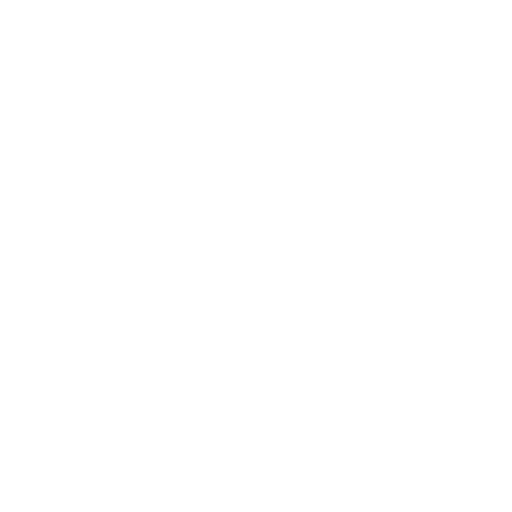
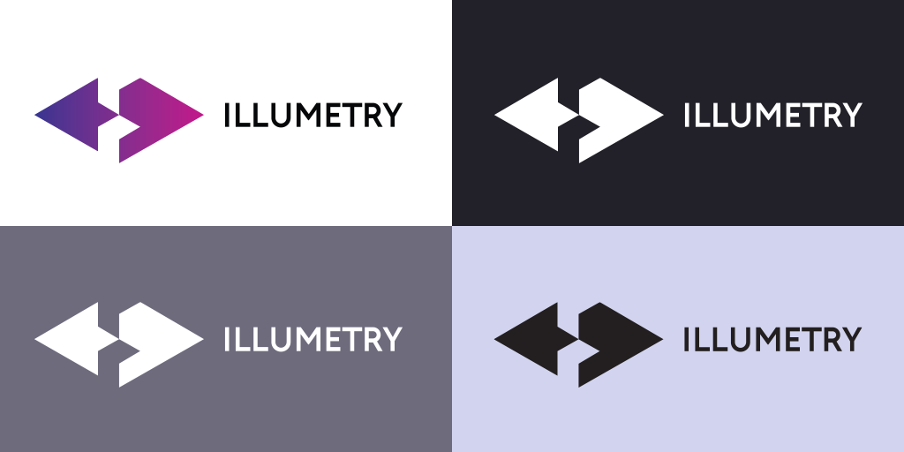
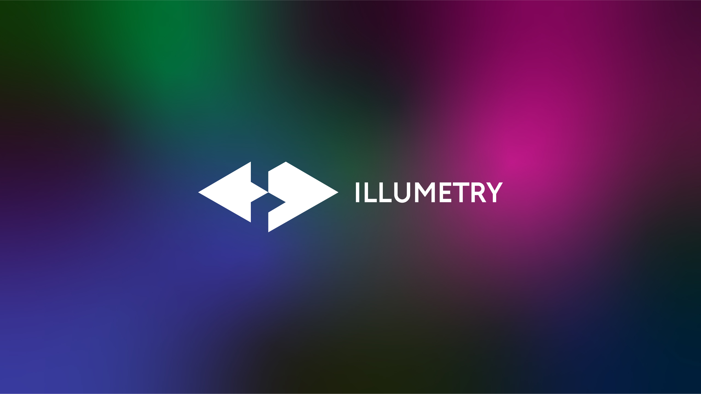

# brandAssets
## Links

https://www.reddit.com/r/illumetry   https://www.reddit.com/u/illumetry

https://www.tiktok.com/@illumetry

https://www.linkedin.com/company/illumetry

https://twitter.com/illumetry

https://www.facebook.com/illumetry

https://www.youtube.com/illumetry

https://www.instagram.com/illumetry

## Logo

### Horizontal logo

logo | png | svg | eps
--- | --- |--- | ---
 | [LogoHorizontal.png](LogoHorizontal.png) | [LogoHorizontal.svg](LogoHorizontal.svg) | [LogoHorizontal.eps](LogoHorizontal.eps)
 |[LogoLightHorizontal.png](LogoLightHorizontal.png) | [LogoLightHorizontal.svg](LogoLightHorizontal.svg) | -
 | [LogoDarkHorizontal.png](LogoDarkHorizontal.png) | [LogoDarkHorizontal.svg](LogoDarkHorizontal.svg) | -
 | [LogoSquare.png](LogoSquare.png) | [LogoSquare.svg](LogoSquare.svg) | [LogoSquare.eps](LogoSquare.eps)
 | [LogoSquareLight.png](LogoSquare.png) | [LogoSquareLight.svg](LogoSquare.svg) | -
 | [LogoSquareDark.png](LogoSquare.png) | [LogoSquareDark.svg](LogoSquare.svg) | -

### Icons

icon | png | svg 
--- | --- |--- 
 | [IconColored.png](IconColored.png) | [IconColored.svg](IconColored.svg)
 | [IconLight.png](IconLight.png) | [IconLight.svg](IconLight.svg)
 | [IconDark.png](IconDark.png) | [IconDark.svg](IconDark.svg)
 | [IconColoredSquare.png](IconColoredSquare.png) | [IconColoredSquare.svg](IconColoredSquare.svg)

## Colors

<!-- name | color | hex | RAL | Pantone
------------ | ------------- | ------------- | ------------- | -------------
Primary |  | 353790 | 2017 | 164 C
Secondary |  | 353790f | 5015 | 2194 C 
on Primary |  | ffffff |   | 
on Secondary |  | ffffff |   | -->

### Gradient

353790 | 473490 | 58308F | 692D8E | 7A298D | 8C268C | 9D228B | AE1E8A | BF1A89
------------ | ------------- | ------------- | ------------- | ------------- | ------------- | ------------- | ------------- | -------------
 |  |  |  |  |  |  |  | 

### Color variations

353790 | 4C4EBD | 797ACD | A6A7DE | D2D3EE | 
------------ | ------------- | ------------- | ------------- | ------------- 
 |  |  |  | 

6FFCBF | 4BFBAE | 23FB9D | 05F08A | 04C873
------------ | ------------- | ------------- | ------------- | ------------- 
 |  |  |  | 

### Gray variations

222129 | 363440 | 4B4957 | 6E6B7D | B0AEBD | CECCD9 | E0DFE6 | EAE9F0
------------ | ------------- | ------------- | ------------- | ------------- | ------------- | ------------- | ------------- 
 |  |  |  |  |  |  | 

## Fonts

Name | Usage | link
------------ | ------------- | -------------
Circe Bold | The font is used for headlines | [Paratype](https://www.paratype.com/fonts/pt/circe)
Inter | Basic text font | [Google Fonts](https://fonts.google.com/specimen/Inter?category=Sans+Serif,Display&subset=cyrillic&preview.text=no%20flip%20flops&preview.text_type=custom#standard-styles)
Roboto | Alternative text font | [Google Fonts](https://fonts.google.com/specimen/Roboto?category=Sans+Serif,Display&subset=cyrillic&preview.text=no%20flip%20flops&preview.text_type=custom&query=roboto)

## Usage

## Backgrounds

