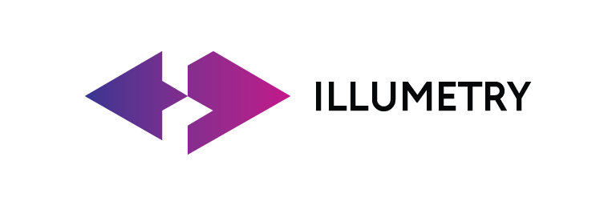

# brandAssets

## Logo

### Horizontal logo

name | color
--- | ---
[LogoHorizontal.png](LogoHorizontal.png) | 
[LogoHorizontal.eps](LogoHorizontal.eps) | -
[LogoHorizontal.svg](LogoHorizontal.svg) | 
[LogoDarkHorizontal.png](LogoDarkHorizontal.png) | 
[LogoDarkHorizontal.svg](LogoDarkHorizontal.svg) | 
[LogoLightHorizontal.png](LogoLightHorizontal.png) | 
[LogoLightHorizontal.svg](LogoLightHorizontal.svg) | 
[LogoSquare.png](LogoSquare.png) | 
[LogoSquare.eps](LogoSquare.eps) | -
[LogoSquare.svg](LogoSquare.svg) | 

### Icons

name | color
--- | ---
[IconColored.png](IconColored.png) | 
[IconColored.svg](IconColored.svg) | 
[IconDark.png](IconDark.png) | 
[IconDark.svg](IconDark.svg) | 
[IconLight.png](IconLight.png) | 
[IconLight.svg](IconLight.svg) | 

## Colors

 name | color | hex | RAL | Pantone
------------ | ------------- | ------------- | ------------- | -------------
Primary |  | ff6d00 | 2017 | 164 C
Secondary |  | 007fff | 5015 | 2194 C 
on Primary |  | ffffff |   | 
on Secondary |  | ffffff |   | 

### Primary color variations

 ff4800 | ff6000 | *ff6d00* | ff7900 | ff8500 | ff9100
------------ | ------------- | ------------- | ------------- | ------------- | -------------
 |  |  |  |  | 

### Secondary color variations

004c99 | 0066cc | _007fff_ | 3299ff | 66b2ff | 66b2ff 
------------ | ------------- | ------------- | ------------- | ------------- | -------------
 |  |  |  |  | 

### Gray variations

222129 | 363440 | 4B4957 | 6E6B7D | B0AEBD | CECCD9 | E0DFE6 | EAE9F0
------------ | ------------- | ------------- | ------------- | ------------- | ------------- | ------------- | -------------
 |  |  |  |  |  |  | 

## Fonts

Name | Usage | link
------------ | ------------- | -------------
Circe Bold | The font is used for headlines | [Paratype](https://www.paratype.com/fonts/pt/circe)
Inter | Basic text font | [Google Fonts](https://fonts.google.com/specimen/Inter?category=Sans+Serif,Display&subset=cyrillic&preview.text=no%20flip%20flops&preview.text_type=custom#standard-styles)
Roboto | Alternative text font | [Google Fonts](https://fonts.google.com/specimen/Roboto?category=Sans+Serif,Display&subset=cyrillic&preview.text=no%20flip%20flops&preview.text_type=custom&query=roboto)

## Usage

